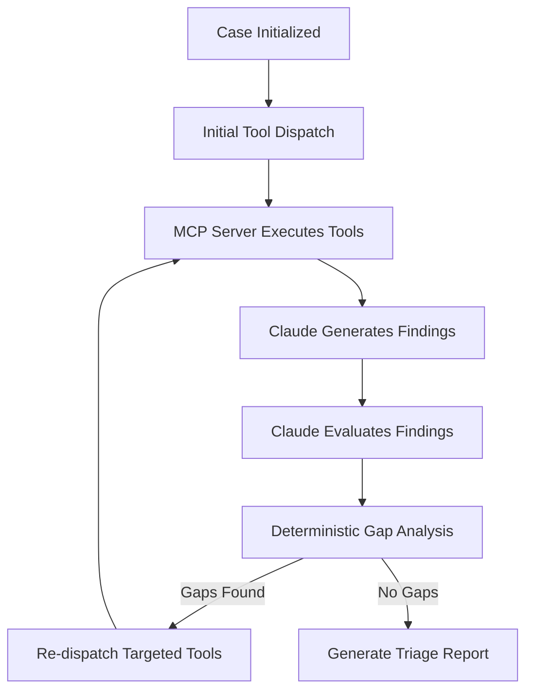

# SentinelMCP Architecture

SentinelMCP is an AI-powered Digital Forensics and Incident Response (DFIR) triage agent. It leverages the Model Context Protocol (MCP) to provide Claude with an extensive toolkit of forensic parsers.

## Core Components

1. **MCP Server (`mcp_server/`)**
   - Implements 16 specialized forensic tools across disk, memory, network, and correlation domains.
   - Utilizes `FastMCP` to serve these tools via an SSE (Server-Sent Events) endpoint.
   - Wraps CLI forensic tools (Volatility 3, tshark, TSK) and parses their output into structured Pydantic/Dataclasses.

2. **Agent Loop (`agent/`)**
   - The brain of the operation. Orchestrates a 6-phase self-correction loop.
   - **Phase 1**: Dispatches tools to the MCP server.
   - **Phase 2 (Triage)**: Sends raw tool outputs to Claude to extract structured findings and IOCs.
   - **Phase 3 (Evaluation)**: Claude assesses the evidence quality of each finding (CONFIRMED, INFERRED, UNSUPPORTED).
   - **Phase 4 (Gap Analysis)**: A deterministic Python engine identifies missing evidence or context based on predefined rules.
   - **Phase 5**: Retargets and re-runs tools based on the identified gaps.
   - **Phase 6**: Checks for convergence (no gaps or max iterations reached).

3. **Real-time Pipeline (`realtime/`)**
   - Ingests streaming telemetry (Sysmon, Defender XDR).
   - Groups events into bursts to trigger automated triage runs.

4. **Shared Models & Configuration (`shared/`)**
   - `models.py`: Immutable data classes acting as the single source of truth.
   - `cache.py`: Thread-safe, in-memory tool result cache.
   - `config.py`: Environment-driven configuration system.

## Data Flow

